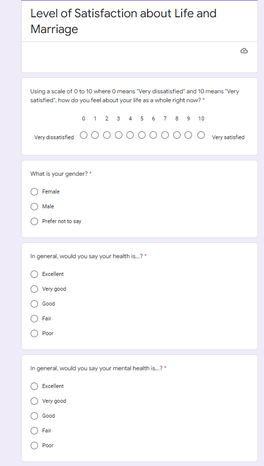

# Introduction

Family plays such an indisputably important role in people’s life. With the rapid development of society, families are facing more changes in conjugal, familial, and financial trajectories. Also, with the families in our society becoming more and more diverse, how individuals’ satisfaction level was impacted by their families has changed and therefore needs further investigation. Life satisfaction reflects people’s feelings about their life and emotions.

Income is an important contributor to one’s life conditions.  (@2002) Previous study concludes that in poor countries, personal income is more significant for life happiness, and that people who value material aspirations are less satisfied than others. Life satisfaction is influenced by objective life quality or the societal context. Working hours are straightly related to one’s work-life balance. How people are adopted to their works is also an indicator of a society’s healthiness degree of its current welfare system. Another factor seems to be crucial to people’s feelings about life is their marriages. Previous researchers have found that married people have higher well-being than people experiencing other relationships or no relationship at all(@Advantage). There are lots of studies investigating the contribution social indicators to people’s feelings about life from multiple aspects, however, recent data and analysis from the mentioned factors conducting in Canada remains inadequate.  

This paper examines the satisfaction level of Canadian citizens and explores it from multiple social factors, with focus on married people and their sex roles. The results suggest that People with higher levels of income and education are more likely to have a better sense of life. Also, after examining the relationship between income and people’s feeling of life, Canadians with relatively lower income are also enjoying life, which supports the current welfare system is healthy in Canada. Moreover, having a stable romantic relationship is conducive to a better feeling of life. With a closer focus on marital status, we found that the differences in social attributes and biological preferences of males and females affect their life feeling patterns while married.

The remaining part of the paper was organized into four major sections. In the Data section, we would first explain the source of the basic data and the methodology we used to process the data. We also included the data characteristic and exploratory data analysis. In the Results section, we plotted three different figures. Figure 3 shows the relationship between age and people’s feelings about life. We also analyzed Feelings about life under multidisciplinary social attributes in figure 4, by which we found we found that married people were more likely to be satisfied with their lives. To further investigate this issue, we plot different groups of working hours by feelings about life, and differentiate them by sex groups. Figure 6 examines the number of total children on feelings about life, by gender. To take a further examination toward this issue, figure 7 investigates the effect of one’s spouse age difference on feelings about life, by gender. In the discussion section, we would begin by commenting on the original survey and questionnaire’s methodology, its key features, strengths, and weaknesses. We would then be presenting our findings. Finally,  a supplementary survey regarding our interested factors, with the URL link and its QR code is including in the appendix section. 


```{r setup, include=FALSE}
knitr::opts_chunk$set(echo = TRUE)
library(readr)
library(tidyverse)
library(dplyr)
library(ggplot2)
library(kableExtra)
library(car)
library(patchwork)
library(gcookbook)           
gss <- read_csv("gss.csv")
library(qrcode)
```

# Data

The dataset we used in this report is the 2017 General Social Survey (GSS) on families in Canada. GSS is viewed as an important foundational social survey within Canada’s national statistical system, and we were able to obtain some points of view toward essential topics if specific social policy issues from it. Current GSS themes are caregiving, families, time use, social identity, volunteering and victimization. There were similar datasets collected within other countries and regions, also with focuses on Canadian’s provinces. However, since we would like to examine the national feelings about life among Canadian citizens, this specific dataset was chosen. This data was selected to examine Canadians’ feelings about life and explore potential causes in other relevant aspects in daily life. The 2017 GSS dataset was collected from 2 February to 30 November 2017 through telephone interviews. This 2017 GSS is a dataset contained a big amount of information about families in Canada. The original survey involves 461 questions overall, which gives this dataset a total number of 461 variables. The sample size for 2017 GSS dataset is 20,602.

The dataset was processed and analyzed in R[@R1] and I analyzed all these using R package including: readr[@readr], tidyverse[@tidyverse], ggplot2[@ggplot2],  gcookbook[@gcookbook], dplyr[@dplyr], kableExtra[@kableExtra], car[@car], patchwork[@patchwork] and qrcode[@qrcode].
## EDA

```{r,echo=FALSE,error=FALSE,warning=FALSE, fig.height = 3, fig.width = 6}
a=c(1,2,3,4,5,6,7,8,9,10)
 ggplot(gss, aes(x= feelings_life)) +
  geom_bar(fill="#19b3a2") +
  theme_classic() + scale_x_continuous(breaks = a)+
  labs(y= "number of response", title="Fig.1 Distribution of Feeling about Life")
feel <- gss %>% select(feelings_life)%>% filter(!is.na(feelings_life))
table1 <- feel %>% summarise(min = min(feelings_life),
                             `1st Qu.` = quantile(feelings_life, 0.25),
                             median = median(feelings_life),
                             `3st Qu.` = quantile(feelings_life, 0.75),
                             max = max(feelings_life),
                             IQR = `3st Qu.` -`1st Qu.`,
                             sd = sd(feelings_life),
                             small_outliers = sum(feelings_life< `1st Qu.` -1.5*IQR),
                             large_outliers = sum(feelings_life> `3st Qu.` +1.5*IQR)) %>% 
  kable(caption = "summary statistic of feeling about life") %>%
  kable_classic(full_width = F, html_font = "Cambria") %>%
  kable_styling(latex_options = "HOLD_position")
table1
```

Figure 1 reflects the distribution of feeling about life as a whole among the survey sample, which is 20602 non-institutional respondents from Canada 2017 general social survey. The current feelings about life as a whole are expressed using a scale of 0 to 10, where 0 means "Very dissatisfied" and 10 means "Very satisfied". All respondents are required to answer the question "how do you feel about your life as a whole right now?". Under the assumption that the sample size is fair enough to represent the whole population, all persons 15 years of age and older in Canada in 2017, without selection bias, we can conclude a general situation of Canadian feelings about life.

The distribution of feelings about life is left-skewed and single-peaked, which means most Canadian people have an above-average (>5) feeling about their life and the major responses are concentrated in the score of 8. Moreover, the second and third largest proportion of scores being selected is 10 and 9, the two best scores can be given by the respondents when filling in the survey. One explanation that counterarguments the positive estimation of Canadian life feeling is Canadians may prone to give extreme emotional expression when rating their feeling of life. However, less number of the response of score 0 is given. Therefore, it is rational to say that Canadians report high levels of happiness about life.

```{r,echo=FALSE, warning=FALSE, fig.height = 12, fig.width = 12}
gss_data <- gss %>% filter(!is.na(income_respondent)&!is.na(education)&!is.na(self_rated_health)&!is.na(self_rated_mental_health)&!is.na(average_hours_worked)&!is.na(average_hours_worked)&!is.na(marital_status)& self_rated_health != "Don't know"& self_rated_mental_health != "Don't know"&average_hours_worked != "Don't know"& marital_status != "Don't know")
g1<-ggplot(gss_data, aes(y= income_respondent)) +
  geom_bar(fill="#69b3a2") +
  theme_classic() +
  labs(x= "number of response", title="Personal Income")
g2<-ggplot(gss_data, aes(y= education)) +
  geom_bar(fill="#69b3a2") +
  theme_classic() +
  labs(x= "number of response", title="Education Level")
g3 <-ggplot(gss_data, aes(y= self_rated_health)) +
  geom_bar(fill="#69b3a2") +
  theme_classic() +
  labs(x= "number of response", title="Self-rated Physical Health")
g4 <-ggplot(gss_data, aes(y= self_rated_mental_health)) +
  geom_bar(fill="#69b3a2") +
  theme_classic() +
  labs(x= "number of response", title="Self-rated Mental Health")
g5 <-ggplot(gss_data, aes(y= average_hours_worked)) +
  geom_bar(fill="#69b3a2") +
  theme_classic() +
  labs(x= "number of response", title="Average Working Hours per Week")
g6 <-ggplot(gss_data, aes(y= marital_status)) +
  geom_bar(fill="#69b3a2") +
  theme_classic() +
  labs(x= "number of response", title="Marital Status")
g_all <- (g1 + g2) /
(g3 + g4) /
(g5 + g6)  +   
  plot_annotation(title = "Fig.2 Six Interested Indicators") & 
  theme(plot.title = element_text(hjust = 0.5))
g_all    
```

Figure 2 shows all six interested groups that may affect the distribution of feelings about life. Panel A is called the "different income_respondent group" and it represents the total income before tax of the respondent of the family. There are 6 groups including here as a scale from the lowest one, “Less than $25,000” to the highest one “$125,000 and more”. The most common category of panel A is $25,000 to $49,999 and the least common category is $100,000 to $ 124,999. It is approximately 5 times more common in the highest category than the lowest one. Therefore, it is rational to say that most Canadians earn under $100,000 per year.

Panel B is called “different education group” and it represents the highest certificate, diploma, or degree that respondent achieved. Among them, the current education is expressed in different 7 classes. The lowest one is called “Less than high school diploma or its equivalent”. And the highest diploma is “University certificate, diploma or degree above the bachelor”.  The most common category of panel B is “High school diploma or a high school equivalency certificate” and the least common category is “University certificate or diploma below the bachelor’s level”. It is approximately 8 times more common in the highest category than the lowest one.

Panel C is called “different self_rated_health group”. In the survey, the original question was :the general health of the respondent, and it was rated by 5 ranks from “Poor” to “Excellent”. The most common category of panel C is “Very good” and the least common category is “Poor”. It is approximately 11 times more common in the highest category than the lowest one. And Panel D represents the general mental health of the respondent. Among them, with the same scale, the excellent and poor still mean the best and worst. The most common category of panel D is “Very good” and the least common category is “Poor”. It is approximately 25 times more common in the highest category than the lowest one.

Panel E is called “different average_hours_worked group” and it represents the average number of hours worked per week in 5 different groups. The lowest one is “0 hour”. And the highest one is “50.1 hours and more”.  The most common category of panel B is “30.0 to 40.0 hours” and the least common category is “0 hour” which is approximately 0. 

Panel F is called “different marital_status group” and it represents the marital status of the respondent in 6 different groups. The most common category of panel F is “Married” and the least common category is “Separated”.  It is approximately 20 times more common in the highest category than the lowest one.


```{r,echo=FALSE, warning=FALSE}
table <-gss %>% filter(!is.na(income_respondent)&!is.na(education)&!is.na(self_rated_health)&!is.na(self_rated_mental_health)&!is.na(average_hours_worked)&!is.na(average_hours_worked)&!is.na(marital_status)& self_rated_health != "Don't know"& self_rated_mental_health != "Don't know"&average_hours_worked != "Don't know"& marital_status != "Don't know")
table1 <- table %>% count(income_respondent, sort = TRUE)
table2 <- table %>% count(education, sort = TRUE) 
table3 <- table %>% count(self_rated_health, sort = TRUE) 
table4 <-table %>% count(self_rated_mental_health, sort = TRUE) 
table5 <-table %>% count(average_hours_worked, sort = TRUE) 
table6 <-table %>% count(marital_status, sort = TRUE) 
list(table1,table6)%>% 
  kable(caption = "summary statistic of interested relevant groups") %>%
  kable_styling(latex_options = "HOLD_position") 
list(table3,table4,table5)%>% 
  kable() %>%
  kable_styling(latex_options = "HOLD_position") 
table2%>% 
  kable() %>%
  kable_styling(latex_options = "HOLD_position") 
```


## Methodology

For the purpose of getting a clear view of each variable’s meaning, firstly, we selected approximately 80 important variables then rewrite their names by gss_dict.txt and AAOnAZHJ.txt. Since we’d like to investigate Canadian citizens’ happiness lever, self-rated feelings about life score was chosen to be the dependent variable. Among all other variables, we chose 6 intuitively relevant feathered ones as independent variables. Lastly, we filtered out all invalid values in each variable since we were not interested in them. Answers including Valid skip, Don’t know, Refusal or Not state are considered invalid values.\


# Result

```{r,echo=FALSE,error=FALSE,warning=FALSE, fig.height = 4, fig.width = 7}
feeling_data <- gss %>% select(feelings_life, age) %>% filter(!is.na(feelings_life))
feeling_data$age <- round(feeling_data$age) 
feelingdata <- feeling_data %>% group_by(age) %>% summarise(mean_feelings_life = mean(feelings_life))
ggplot(feelingdata, aes(x=age, y = mean_feelings_life)) +
geom_line()+ 
  theme(panel.grid = element_line(color = "#8ccde3",
                                  size = 0.5,
                                  linetype = 2))+
  labs(x = "age", y = "average feelings of life from 0 to 10", title = "Fig.3 Relationship Between Age and Feelings About Life") 
```

To gain a further understanding of Canadians' feeling about life, we visualized the average feeling about life in each age (15-80 years old). According to Figure 3, we noticed that in childhood, starting from the age of 15, the score of feelings about life is the highest, reaching an average of 8.7. However, the ratings experience a sharp drop immediately, reaching the lowest point around the age of 22, at about 7.65, about 12 percentage points within 7 years, which may be related to the responsibility and stress brought by the separation from childhood. After that, the happiness of life rebounded, but it fell to a local minimum again around the age of 43, and gradually increased as the middle-aged entered old age. Happiness in the 20s to 50s range can be summed up as a notion of U-shape, which is often cited as evidence of the midlife crisis.

There is no doubt that the feeling about life is highly correlated with age, but focusing on a single trajectory of happiness has limited scientific and applied value because it obscures the diversity of entire life processes and their sources. There are researches that criticize the robustness that uses U-shape to generalize people's cross-life happiness as well as corroboration of midlife crisis. (The U Shape of Happiness Across the Life Course: Expanding the Discussion) It points out that multidisciplinary statistical analysis is necessary to conduct. Given that we could not get enough data from the single-year survey to examine individual differences in how and why people change in different settings and at different stages of life, we choose to focus on multidisciplinary social attributes that are not affected by the time to generalize the correlates of the feeling of life.

## Feelings about life under multiple social attributes


```{r,echo=FALSE,error=FALSE,warning=FALSE}

income_data <- gss %>% select(income_respondent, feelings_life) %>% filter(!is.na(feelings_life) & !is.na(income_respondent))
incomedata <- income_data %>%group_by(feelings_life) %>% summarise("<$25,000" = sum(income_respondent == "Less than $25,000"),"$25,000 to $49,999" = sum(income_respondent == "$25,000 to $49,999"), "$50,000 to $74,999" = sum(income_respondent == "$50,000 to $74,999"),"$75,000 to $99,999" = sum(income_respondent == "$75,000 to $99,999"), "$100,000 to $124,999" = sum(income_respondent == "$100,000 to $ 124,999"),"$125,000 and more" = sum(income_respondent == "$125,000 and more"))
incomedata$`<$25,000` = incomedata$`<$25,000`/sum(incomedata$`<$25,000`)
incomedata$`$25,000 to $49,999` = incomedata$`$25,000 to $49,999`/sum(incomedata$`$25,000 to $49,999`)
incomedata$`$50,000 to $74,999` = incomedata$`$50,000 to $74,999`/sum(incomedata$`$50,000 to $74,999`)
incomedata$`$75,000 to $99,999` = incomedata$`$75,000 to $99,999`/sum(incomedata$`$75,000 to $99,999`)
incomedata$`$100,000 to $124,999` = incomedata$`$100,000 to $124,999`/sum(incomedata$`$100,000 to $124,999`)
incomedata$`$125,000 and more` = incomedata$`$125,000 and more`/sum(incomedata$`$125,000 and more`)
dfb<-gather(incomedata,key=income_group,value=percent_of_Respondent,c("<$25,000","$25,000 to $49,999","$50,000 to $74,999","$75,000 to $99,999","$100,000 to $124,999","$125,000 and more"))
gfa<- ggplot(dfb, aes(x=feelings_life, y = percent_of_Respondent, group = income_group, colour = income_group)) +
  geom_line() +
  theme_classic() + scale_x_continuous(breaks = a)+
  labs( title="Average Feelings About Life by Different Income Level")
```

```{r,echo=FALSE,error=FALSE,warning=FALSE}
edu_data <- gss %>% select(education, feelings_life) %>% filter(!is.na(feelings_life) & !is.na(education))
group <- edu_data %>%group_by(education) %>% summarise(n=n())
edudata <- edu_data %>%group_by(feelings_life) %>% summarise("high school" = sum(education == "High school diploma or a high school equivalency certificate"),"below high school" = sum(education == "Less than high school diploma or its equivalent"), "college" = sum(education == "College, CEGEP or other non-university certificate or di..."),"Bachelor" = sum(education == "Bachelor's degree (e.g. B.A., B.Sc., LL.B.)"), "trade certificate" = sum(education == "Trade certificate or diploma"),"under Bachelor" = sum(education == "University certificate or diploma below the bachelor's level"), "above Bachelor" = sum(education == "University certificate, diploma or degree above the bach...")) 
edudata$`high school` = edudata$`high school`/sum(edudata$`high school`)
edudata$`below high school` = edudata$`below high school`/sum(edudata$`below high school`)
edudata$college = edudata$college /sum(edudata$college)
edudata$Bachelor =edudata$Bachelor /sum(edudata$Bachelor)
edudata$`trade certificate` = edudata$`trade certificate`/ sum(edudata$`trade certificate`)
edudata$`under Bachelor` = edudata$`under Bachelor` /sum(edudata$`under Bachelor`)
edudata$`above Bachelor` =edudata$`above Bachelor` /sum(edudata$`above Bachelor`)
dfc <- gather(edudata, key = education_group, value = percent_of_Respondent, c("below high school", "high school","trade certificate","college", "under Bachelor", "Bachelor","above Bachelor"))
gfb <- ggplot(dfc, aes(x=feelings_life, y = percent_of_Respondent, group = education_group, colour = education_group)) +
  geom_line() +
  theme_classic() + scale_x_continuous(breaks = a)+
  labs( title="Average Feelings About Life by Education Level")
```

```{r,echo=FALSE,error=FALSE,warning=FALSE}
health_data <- gss %>% select(self_rated_health, feelings_life) %>% filter(!is.na(feelings_life) & !is.na(self_rated_health)& self_rated_health != "Don't know")
group <- health_data %>%group_by(self_rated_health) %>% summarise(n=n())
healthdata <- health_data %>%group_by(feelings_life) %>% summarise("Excellent" = (sum(self_rated_health == "Excellent")),"Fair" = (sum(self_rated_health == "Fair")),"Good" = (sum(self_rated_health == "Good")),"Poor" = (sum(self_rated_health == "Poor")),"Very good" = (sum(self_rated_health == "Very good")))
healthdata$Excellent = healthdata$Excellent /sum(healthdata$Excellent)
healthdata$Fair = healthdata$Fair/sum(healthdata$Fair)
healthdata$Good = healthdata$Good/sum(healthdata$Good)
healthdata$Poor = healthdata$Poor/sum(healthdata$Poor)
healthdata$`Very good` = healthdata$`Very good`/ sum(healthdata$`Very good`)
dff <- gather(healthdata, key = health_group, value = percent_of_Respondent, c("Excellent", "Fair","Good", "Poor", "Very good"))
 gfc <- ggplot(dff, aes(x=feelings_life, y = percent_of_Respondent, group = health_group, colour = health_group)) +
  geom_line() +
  theme_classic() + scale_x_continuous(breaks = a)+
  labs( title="Average Feelings About Life by Self-rated Physical Health")
```

```{r,echo=FALSE,error=FALSE,warning=FALSE}
mental_health_data <- gss %>% select(self_rated_mental_health, feelings_life) %>% filter(!is.na(feelings_life) & !is.na(self_rated_mental_health)& self_rated_mental_health != "Don't know")
group <- mental_health_data %>%group_by(self_rated_mental_health) %>% summarise(n=n())
mentalhealth_data <- mental_health_data %>%group_by(feelings_life) %>% summarise("Excellent" = (sum(self_rated_mental_health == "Excellent")),"Fair" = (sum(self_rated_mental_health == "Fair")),"Good" = (sum(self_rated_mental_health == "Good")),"Poor" = (sum(self_rated_mental_health == "Poor")), "Very good"= (sum(self_rated_mental_health == "Very good")))
mentalhealth_data$Excellent = mentalhealth_data$Excellent/sum(mentalhealth_data$Excellent)
mentalhealth_data$Fair = mentalhealth_data$Fair /sum(mentalhealth_data$Fair)
mentalhealth_data$Good = mentalhealth_data$Good /sum(mentalhealth_data$Good)
mentalhealth_data$Poor = mentalhealth_data$Poor/sum(mentalhealth_data$Poor)
mentalhealth_data$`Very good` =mentalhealth_data$`Very good`/sum(mentalhealth_data$`Very good`)
dfh <- gather(mentalhealth_data, key = mental_health_group, value = percent_of_Respondent, c("Excellent", "Fair","Good", "Poor", "Very good"))
gfd <- ggplot(dfh, aes(x=feelings_life, y = percent_of_Respondent, group = mental_health_group, colour = mental_health_group)) +
  geom_line() +
  theme_classic() + scale_x_continuous(breaks = a)+
  labs( title="Average Feelings About Life by Self-rated Mental Health")
```

```{r,echo=FALSE,error=FALSE,warning=FALSE}
work_data <- gss %>% select(average_hours_worked, feelings_life) %>% filter(!is.na(feelings_life) & !is.na(average_hours_worked)& average_hours_worked != "Don't know")
group <- work_data %>%group_by(average_hours_worked) %>% summarise(n=n())
workdata <- work_data %>%group_by(feelings_life) %>% summarise("0 hour" = (sum(average_hours_worked == "0 hour")),"0.1 to 29.9 hours" = (sum(average_hours_worked == "0.1 to 29.9 hours")),"30.0 to 40.0 hours" = (sum(average_hours_worked == "30.0 to 40.0 hours")),"40.1 to 50.0 hours" = (sum(average_hours_worked == "40.1 to 50.0 hours")),"50.1 hours and more" = (sum(average_hours_worked == "50.1 hours and more")))
workdata$`0 hour` = workdata$`0 hour`/sum(workdata$`0 hour`)
workdata$`0.1 to 29.9 hours` = workdata$`0.1 to 29.9 hours`/sum(workdata$`0.1 to 29.9 hours`)
workdata$`30.0 to 40.0 hours` = workdata$`30.0 to 40.0 hours`/ sum(workdata$`30.0 to 40.0 hours`)
workdata$`40.1 to 50.0 hours` = workdata$`40.1 to 50.0 hours`/sum(workdata$`40.1 to 50.0 hours`)
workdata$`50.1 hours and more` = workdata$`50.1 hours and more`/sum(workdata$`50.1 hours and more`)
 dff <- gather(workdata, key = working_hour_per_week_group, value = percent_of_Respondent, c("0 hour", "0.1 to 29.9 hours","30.0 to 40.0 hours", "40.1 to 50.0 hours", "50.1 hours and more"))
gfe <- ggplot(dff, aes(x=feelings_life, y = percent_of_Respondent, group = working_hour_per_week_group, colour = working_hour_per_week_group)) +
  geom_line() +
  theme_classic() + scale_x_continuous(breaks = a)+
  labs( title="Average Feelings About Life by Working Hours per Week")
```

```{r,echo=FALSE,error=FALSE,warning=FALSE}
marital_data <- gss %>% select(marital_status, feelings_life) %>% filter(!is.na(feelings_life) & !is.na(marital_status)& marital_status != "Don't know")
group <- marital_data %>%group_by(marital_status) %>% summarise(n=n())
maritaldata <- marital_data %>%group_by(feelings_life) %>% summarise("Divorced" = (sum(marital_status == "Divorced")),"Living common-law" = (sum(marital_status == "Living common-law")),"Married" = (sum(marital_status == "Married")),"Separated" = (sum(marital_status == "Separated")),"Single, never married" = (sum(marital_status == "Single, never married")), "Widowed" = (sum(marital_status == "Widowed")))
maritaldata$Divorced = maritaldata$Divorced/ sum(maritaldata$Divorced)
maritaldata$`Living common-law` = maritaldata$`Living common-law`/ sum(maritaldata$`Living common-law`)
maritaldata$Married = maritaldata$Married/ sum(maritaldata$Married)
maritaldata$Separated =maritaldata$Separated/sum(maritaldata$Separated)
maritaldata$`Single, never married` = maritaldata$`Single, never married` /sum(maritaldata$`Single, never married`)
maritaldata$Widowed = maritaldata$Widowed /sum(maritaldata$Widowed)
dfg <- gather(maritaldata, key = marital_group, value = percent_of_Respondent, c("Divorced", "Living common-law","Married", "Separated","Single, never married","Widowed"))
gff <- ggplot(dfg, aes(x=feelings_life, y = percent_of_Respondent, group = marital_group, colour = marital_group)) +
  geom_line() +
  theme_classic() + scale_x_continuous(breaks = a)+
  labs( title="Average Feelings About Life by Marital Status")
```

```{r,echo=FALSE, warning=FALSE, fig.height = 12, fig.width = 12}
gg_all <- (gfa + gfb) /
(gfc + gfd) /
(gfe + gff)  +    # Create grid of plots with title
  plot_annotation(title = "Fig.4 Average Feelings about Life by Six Indicators ") & 
  theme(plot.title = element_text(hjust = 0.5))
gg_all 
```


In Figure 4 panel A, we draw the respondents’ happiness level by their income group. All groups show a similar pattern in this plot, with a shift up when the income increases by one group when people are feeling good about their life. Among the respondents who rated high happiness score, the most proportion was taken up by people who have higher income, specifically, the more people earned, the happier they feel. Between feelings of life score 4-6, people who earned the least took the largest proportion, the proportion of respondents increases as they earn less. The difference in happiness is unobservable among people who rated 0-4 and 6-8. From these patterns, we can see that the people’s feelings of life in each income group are aligned with the general pattern, with a higher fluctuation in higher income groups. It is eligible to say that income level affects people’s happiness level in a way, but not a crucial one. 

Panel B of Figure 4 checks the potential effect of people’s educational level on feelings of life. We can see from the graph, the lines are nearly paralleled before the score of life feeling reached to 9. The trend of this graph is also aligned with the general pattern of all respondents’ feelings of life score, which is also the overall pattern of panel 4, there is possibly a high correlation between income and educational levels. People who receive lower education have a larger proportion in happiness level is less than 6. The most proportion of the people who are feeling excellent about their life, rate above 9 at feelings of life, comes from those whose highest education is college. It is eligible to say that although the educational level doesn’t contribute much to how respondents feel about their lives, the group of people who receive a college diploma have a higher ability to gain happiness in life. 

In panel C, we examined the relevance between different health groups and people’s feelings of life. Each group shows a left-skewed pattern in this graph, however, with a much different extent. With the declines in self-rated health scores, the extent of left-skewed is gradually diminished. The pattern of excellent health group shows an extremely left-skewed trend with only one mode. The skewness in the shape of self-rated fair health level becomes much milder, also, a double-peaked pattern shows in this group. A very classic double-peaked pattern shows in the group which self-rated poor in health. The patterns in different health groups have relatively apparent differences with the overall trend, which indicates distinct health situations have a relatively remarkable effect on people’s feelings of life. 

In Figure4, panel D shows how people’s mental health situations can relate to their feeling about life. People who are poor in mental health have a relatively flattened distribution compared to other groups, with a peak at the score of 5. In addition, the proportion of people in this group whose happiness level is above the overall average is extremely small. The trends of respondents’ proportion of good and very good mental health situations basically align with the overall general distribution. The shape of an excellent mental health group is similar to the distribution of an excellent physical health group. There might exist a correlation between excellent physical health groups and excellent mental health groups. Intuitively, physical health would surely influence people’s experience, however, mental health can be a result of what’s going on in current life. 

Panel E of Figure 4 illustrates people’s feelings of life by their different number of hours worked per week. Surprisingly, the happiness level of people who don’t work at all is not even reaching the average level. This group concentrated on a happiness level of 5, the proportion of 5 rating people in this group is much more than the other groups. The overall happiness level of people who work above 50 hours, the longest working hours, is the second to last among all. The two extreme working markets are disadvantages to the majority’s happiness level. The comprehensive highest happiness level belongs to respondents who work 40.1 – 50.0 hours per week, the second-highest group is 30 – 40 hours per week. It is appropriate to conclude that working 6 – 8 hours per week is reasonable and beneficial to people’s feelings. Yet it is worth noting that people who work more than 50 hours per week have a high share in the extremely high happiness group. These scores were possibly rated by people who work long hours and have a high income, which also reveals the considerable internal variation in this group. Generally speaking, working 40.1 – 50 hours per week is most beneficial to feelings of life.

In Figure 4, panel F reviews how people’s happiness levels vary in different marital statuses. In all 6 groups of marital status, the married group has the happiest life experience. The distribution of married people in the percentage of respondents has the most left-skewed shape among all groups, which suggests that there is the highest proportion of people who feel very good and excellent in their lives. The living common-law group has the most proportion at around 7.5 scores, the proportion of people who feel low in happiness is also low. However, there are only few people in this living common-law group who reach a very high happiness level. Among single living respondents (Separated, Single and never married, Widowed groups), the widowed group of people has comprehensively nicer feelings of life, on the contrary, people who are separated from their partners have the lowest happiness level. We might be able to conclude that separated situation is most to the disadvantage of people’s feelings of life. Therefore, having a romantic relationship is beneficial to delightful life. 

We are surprised by how romantic relationships help people to gain a joyful life, also the face that widowed group has the highest feelings of life score among people who live alone. Additionally, in our sample, about 6,000 respondents are married, which approximately equals the sum of the rest five groups. Since the significance of marriages shows in the distribution and a large number of married respondents in our sample data, we would like to further investigate how and why married status can be beneficial to individuals’ feelings of life. 


## Feelings about life of married people, with focus on sexual difference 

In the above study, we found that married people were more likely to be satisfied with their lives. For the purpose of finding methods to achieve a better life experience, we focused on the group of people under married status. Specifically, we aimed to make a summary of the characteristics that a marriage of high life happiness has. In this process, we found that the overall feelings about the life pattern of males and females are consistent in the absence of limited conditions; However, in the context of marriage, men and women show different characteristics for specific social factors. This means that couples in a marriage should pay attention to each other's differences in their pursuit of a happy life since they have different priorities to maintain or adjust.

### Average working hour per week on feelings about life, by gender

```{r,echo=FALSE,error=FALSE,warning=FALSE}
tmp2 <- gss %>% select(average_hours_worked, feelings_life, sex) %>% filter(!is.na(feelings_life) & !is.na(average_hours_worked) &!is.na(sex) & average_hours_worked != "Don't know")
tmp21<- tmp2 %>%filter(sex =="Male")
tmp22<- tmp2 %>%filter(sex =="Female")
tmp211 <- tmp21 %>%group_by(average_hours_worked) %>% summarise(feelings_life_male = mean(feelings_life))
tmp212 <-tmp211 %>% mutate(average_hour = case_when(average_hours_worked == "0 hour" ~ 0,
                                                    average_hours_worked == "0.1 to 29.9 hours" ~ 30,
                                                    average_hours_worked == "30.0 to 40.0 hours" ~ 40,
                                                    average_hours_worked == "40.1 to 50.0 hours" ~ 50,
                                                    average_hours_worked == "50.1 hours and more" ~ 60))
tmp221 <- tmp22 %>%group_by(average_hours_worked) %>% summarise(feelings_life_female = mean(feelings_life))
tmp222 <-tmp221 %>% mutate(average_hour = case_when(average_hours_worked == "0 hour" ~ 0,
                                                    average_hours_worked == "0.1 to 29.9 hours" ~ 30,
                                                    average_hours_worked == "30.0 to 40.0 hours" ~ 40,
                                                    average_hours_worked == "40.1 to 50.0 hours" ~ 50,
                                                    average_hours_worked == "50.1 hours and more" ~ 60))
tmp3 <- merge(tmp212,tmp222,by=c("average_hour"))
tmp4 <- gather(tmp3, key = feeling_of_different_sex, value = feeling_of_life, c("feelings_life_male","feelings_life_female"))
ggplot(tmp4, aes(x=average_hour, y = feeling_of_life, group = feeling_of_different_sex, colour = feeling_of_different_sex)) +
  geom_line() +
  theme_classic()+
  labs(x = "average_hour of work per week" ,title="Fig.5 Average Feelings about Life by Working Hours per Week of Different Gender")
```

Based on the Figure 5, increasing average hours of work per week has a positive influence on the rating score of feelings about life for Canadian people. However, the patterns have a prominent gap between that of males and females.

Married men and women both had their lowest life satisfaction during unemployment, but the severity varied widely—women's average life feeling was about 7.6, and men's about 6.1. With the increase of working hours to at least 20 hours per week, the life satisfaction of married men has greatly improved, reaching about 7.75, which is close to the average life satisfaction, and the life satisfaction of women also shows a clear upward trend. Subsequently, the life satisfaction of men continued to rise with the increase of working hours, and the highest rating score occurs when the working hour is least 60 hours per week, and their average life satisfaction reached about 8.3; while women's average life satisfaction reached its peak, about 7.7, when the working hours per week rose to 40-60 hours, which is similar to the maximum value for men, but the happiness value drops after working more than 60h per week, and it is almost the same as that when working 20-40h per week.

In conclusion, having a job is one of the ways to increase life satisfaction for both married men and women, and this feature is also in line with global law summarised by other researchers (@Happiness). It's worth noting that the changing process from unemployed to employed has the largest marginal effect, especially for men, whose life satisfaction is significantly lower than the national average when having no job or business. Longer working hours, that is, more than 60 hours per week, are still more attractive to men, and even the marginal effect does not completely show a gradually decreasing trend; for women, however, extremely long hours (longer than 60 hours a week) have a negative impact on life satisfaction. This may be due to physical differences between men and women, as well as different expectations and obligations imposed by society.

### Number of total children on feelings about life, by gender

```{r,echo=FALSE,error=FALSE,warning=FALSE}
t_mp2 <- gss %>% select(total_children, feelings_life, sex) %>% filter(!is.na(feelings_life) & !is.na(total_children) &!is.na(sex))
t_mp21<- t_mp2 %>%filter(sex =="Male")
t_mp22<- t_mp2 %>%filter(sex =="Female")
t_mp211 <- t_mp21 %>%group_by(total_children) %>% summarise(feelings_life_male = mean(feelings_life))

t_mp221 <- t_mp22 %>%group_by(total_children) %>% summarise(feelings_life_female = mean(feelings_life))
t_mp3 <- merge(t_mp211,t_mp221,by=c("total_children"))
t_mp4 <- gather(t_mp3, key = feeling_of_different_sex, value = feeling_of_life, c("feelings_life_male","feelings_life_female"))
ggplot(t_mp4, aes(x=total_children, y = feeling_of_life, group = feeling_of_different_sex, colour = feeling_of_different_sex)) +
  geom_line() +
  theme_classic() + scale_x_continuous(breaks = a)+ 
  labs( title="Fig.6 Average Feelings about Life by Total Children of Different Gender")
```

Children are undoubtedly an important proposition in married life. With the emancipation of the mind, the reform of the economic environment, the improvement of women's status, and other social factors, topics such as reproductive rights and DINK freedom have been widely discussed. According to the above figure, we can initially see the general attitude of the married population to the number of births, and the pattern difference between the total number of children and its impact on life satisfaction on men and women.

Childlessness showed a negative impact on the life of married men and women, but less on women: the average life satisfaction of married women without children was higher than 7.95, which was close to the average; the average of married men without children Life satisfaction is about 7.8. After having the first child, the life satisfaction of married men and women is significantly improved. The marginal effect is particularly obvious for men, and the average life satisfaction is higher than that of women when they have two children. Then, when the total number of children is between 2 and 6, the average life satisfaction of married men and women both fluctuates in the same trend. Specifically, the overall average value of men is higher and their fluctuation is more moderate and reaches the highest value of 8.3 when they have 6 children. Finally, when the total number of children reached 7, the average life satisfaction of men plummeted, about the same as when the total number of children os 1; however, the life satisfaction of women continued to climb, reaching a peak of 8.5.

Using this dataset, we could see that most married couples hope to have children of their own, and men tend to get more happiness from having children. However, while having too many children caused men's life satisfaction to plummet, women showed surprising acceptance. Such a conclusion conflicts with some other studies: “Happiness, life satisfaction and well-being: Survey Design and Response Analysis” mentioned that "Having children increases happiness and well-being in women while it has no Effect on males ". This may be due to differences in the definition of life satisfaction and life happiness, or we adopt the wrong way to build the relationship between the feeling of life and total children. In any case, more research is necessary to be conducted. 

### Spouse age difference on feelings about life, by gender


```{r,echo=FALSE,error=FALSE,warning=FALSE}
age_diff_data <- gss %>% select(age_diff, feelings_life,sex) %>% filter(!is.na(feelings_life) & !is.na(age_diff)& age_diff != "Don't know" & sex == "Male")
tmp1 <- age_diff_data %>%group_by(age_diff) %>% summarise(feelings_life = mean(feelings_life))
tmp11 <-tmp1 %>% mutate(agediff = case_when(age_diff == "Respondent and spouse/partner are same age" ~ 0,
                                                    age_diff == "Respondent is 1 year older" ~ 1,
                                                    age_diff == "Respondent is 2 years older" ~ 2,
                                                    age_diff == "Respondent is 3 years older" ~ 3,
                                                    age_diff == "Respondent is 4 years older" ~ 4,
                                                    age_diff == "Respondent is 5 years older"~ 5,
                                                    age_diff == "Respondent is 6 to 10 years older" ~ 6,
                                                    age_diff == "Respondent is 11+ years older" ~ 7)) %>% select(agediff,feelings_life)%>% filter(!is.na(agediff))
tmp12 <-tmp1 %>% mutate(agediff = case_when(age_diff == "Respondent and spouse/partner are same age" ~ 0,
                                                    age_diff == "Respondent is 1 year younger" ~ 1,
                                                    age_diff == "Respondent is 2 years younger"~ 2,
                                                    age_diff == "Respondent is 3 years younger"~ 3,
                                                    age_diff == "Respondent is 4 years younger"~ 4,
                                                    age_diff == "Respondent is 5 years younger"~ 5,
                                                     age_diff == "Respondent is 6 to 10 years younger"~ 6,
                                                    age_diff == "Respondent is 11 + years younger"~ 7)) %>% select(agediff,feelings_life)%>% filter(!is.na(agediff))
tmp3 <- merge(tmp11,tmp12,by=c("agediff"))
colnames(tmp3)<- c("agediff","feelings_life older", "feelings_life younger")
tmp4 <- gather(tmp3, key = feeling_of_agediff, value = feeling_of_life, c("feelings_life older", "feelings_life younger"))
gfg <- ggplot(tmp4, aes(x=agediff, y = feeling_of_life, group = feeling_of_agediff, colour = feeling_of_agediff)) +
  geom_line() +
  theme_classic()+
  labs(x = "difference of age for male", title="Fig.7 Average Feelings about Life by Working Hours of Male")
```

```{r,echo=FALSE,error=FALSE,warning=FALSE,fig.height=6 , fig.width = 12}
age_diff_data <- gss %>% select(age_diff, feelings_life,sex) %>% filter(!is.na(feelings_life) & !is.na(age_diff)& age_diff != "Don't know" & sex == "Female")
tmp1 <- age_diff_data %>%group_by(age_diff) %>% summarise(feelings_life = mean(feelings_life))
tmp11 <-tmp1 %>% mutate(agediff = case_when(age_diff == "Respondent and spouse/partner are same age" ~ 0,
                                                    age_diff == "Respondent is 1 year older" ~ 1,
                                                    age_diff == "Respondent is 2 years older" ~ 2,
                                                    age_diff == "Respondent is 3 years older" ~ 3,
                                                    age_diff == "Respondent is 4 years older" ~ 4,
                                                    age_diff == "Respondent is 5 years older"~ 5,
                                                    age_diff == "Respondent is 6 to 10 years older" ~ 6,
                                                    age_diff == "Respondent is 11+ years older" ~ 7)) %>% select(agediff,feelings_life)%>% filter(!is.na(agediff))
tmp12 <-tmp1 %>% mutate(agediff = case_when(age_diff == "Respondent and spouse/partner are same age" ~ 0,
                                                    age_diff == "Respondent is 1 year younger" ~ 1,
                                                    age_diff == "Respondent is 2 years younger"~ 2,
                                                    age_diff == "Respondent is 3 years younger"~ 3,
                                                    age_diff == "Respondent is 4 years younger"~ 4,
                                                    age_diff == "Respondent is 5 years younger"~ 5,
                                                     age_diff == "Respondent is 6 to 10 years younger"~ 6,
                                                    age_diff == "Respondent is 11 + years younger"~ 7)) %>% select(agediff,feelings_life)%>% filter(!is.na(agediff))
tmp3 <- merge(tmp11,tmp12,by=c("agediff"))
colnames(tmp3)<- c("agediff","feelings_life older", "feelings_life younger")
tmp4 <- gather(tmp3, key = feeling_of_agediff, value = feeling_of_life, c("feelings_life older", "feelings_life younger"))

gfh <-ggplot(tmp4, aes(x=agediff, y = feeling_of_life, group = feeling_of_agediff, colour = feeling_of_agediff)) +
  geom_line() +
  theme_classic()+
  labs(x = "difference of age for female", title="Fig.7 Average Feelings about Life by Working Hours of Female")
(gfg | gfh)
```

As can be seen from the above figure, there is a gap in the age range of ideal spouses for men and women in the purpose of chasing a satisfying life. Panel A on the left depicts the difference in average life satisfaction for men with varying degrees of older and younger spouses, while panel B depicts women's. It can be clearly observed that men with younger spouses generally have higher life satisfaction, while the opposite is true for women. The overall volatility of male data is greater, which may be due to the smaller amount of data for the relevant age group. But through cursory observation, it can be found that for men, those who have a spouse 2-4 years younger than themselves have the highest average life satisfaction. Women's average life satisfaction tends to decline in general as the age gap with their spouses increases, both in groups with older and younger spouses. Among them, married women have the highest average life satisfaction when their spouse is 2 years older than them; the second highest is the group with a spouse who is two years younger than them. When the spouses are more than 6 years younger than themselves, the average life satisfaction of women drops significantly, reaching a minimum value of around 7.75.

Therefore, we conclude that men and women are more likely to have a more satisfying life when they have a spouse with a smaller age gap; the difference is that men would generally tend to choose a spouse younger than themselves, while women would tend to choose a spouse who is younger than them, based on the statistical analysis.

# Discussion

## Survey

1. Methodology

This paper conducts analysis based on the dataset from the 2017 General Social Survey (GSS) on the family. The survey targets on the population including all non-institutionalized persons 15 years of age and older, living in the 10 provinces of Canada (excluding Yukon, Northwest Territories, and Nunavut). The frame that survey adopted the redesigned GSS frame, which integrates data from sources of telephone numbers (landline and cellular) available to Statistics Canada and the Address Register (AR). This new frame includes “cell phone only” households, a growing population not covered by the previous frame. Data for the 2017 GSS was collected via computer assisted telephone interviews (CATI) from February 2 to November 30, 2017. Respondents were randomly selected from households that meet the eligibility criteria and interviewed in the official language of their choice without permission of proxy interviews. 

2. Key features

The 2017 GSS dataset aims to understand the increasingly diverse family characteristics and socio-economic conditions. To meet this object, the data collected by GSS consists of two components: core content and classification variables. The core content aims to measure social changes related to living conditions and well-being. Categorical variables (e.g. age, sex, education, and income) help describe the population groups used to analyze the core data.

Moreover, the respondents from the GSS do not form a simple random sample of the target population. The survey is designed in a complex way, with stratification, multiple stages of selection and unequal selection probabilities for respondents, to better balance the sample weight. Especially, the stratified design has significant differences in sampling fractions between strata. 

3. Strengths

We believe that the sample can be assessed as statistically reliable for two main reasons. First, the actual sample size (20,602) arrives at the requirement of the target sample size (20,000). Second, the sample size in each province has been accurately controlled in order to either satisfy the acceptable sampling variability at the stratum level or balance the need for precision of both national-level and stratum-level estimates.

The data quality is guaranteed to the greatest extent as well. Quality assurance measures are applied at every step of the data collection and processing cycle to monitor the quality of the data, including the use of highly skilled interviewers and coding and editing quality checks to verify processing logic, etc. 

4. Weakness

There exist non-sampling errors and sampling errors in the survey. 

Firstly, the non-sampling errors are caused by non-response on the survey results, constituted by two situations: partial non-response that fails to answer one or a few questions, or total non-response. However, the total non-response problem was addressed by adjusting the weight of participating households to compensate for those who did not participate. Therefore, the non-sampling errors were concentrated on partial non-response. There are several causes, including the respondents did not understand or misunderstand questions, refused to answer, or were unable to recall requested information.

Secondly, sampling errors may also occur as the selected samples cannot fairly represent the entire population of data. Statistical practice indicates a magnitude of this sampling error: The chances are about 68 out of 100 that the difference between the sample estimate and the true population value would be less than one standard error, about 95 out of 100 that the difference would be less than two standard errors, and virtually certain that the differences would be less than three standard errors.

## Questionnaire

The laudable design of this questionnaire lies in the direct transmission of all the data that can be obtained from relevant statistical institutions, such as personal income level and working hours, which improves the objectivity of the sample and avoids respondents' boredom and giving up due to too many questions. However, some questions in the questionnaire have not been accurately defined, such as feelings about life, which has a negative impact on the accuracy of the questionnaire and the convenience of users. At the same time, the questions lack the measurement to separate the response based on short and long-term experience, so as to better analyze the applicable time range for the answers.

To make improvements, in the supplemental survey, we designed the question aimed at measuring the short-term fluctuated occurrence, to measure whether the respondents' answers were a summary of a long period of life rather than being influenced by short-term accidental events. In addition, we focused on the population under married status, refined the restrictions on life feeling, and proposed other potential social indicators.

## Findings

1. Higher personal income and education level have a positive effect on the feelings about life


From the results, people with higher income and education levels are more likely to have better life satisfaction. Among them, income has a more prominent role in the more extreme life feelings. In other words, groups of high, middle, and low income have a similar share at the mean score of life satisfaction. It indicates a possible situation that the primary way Canadians generally achieve happiness is not income-focused. For example, having dinner at a restaurant with three Michelin stars requires a high personal income, but spending a weekend by the lake with your family doesn't.

However, when the feeling about life is in the low score area(4-6) and the extremely high score area (9-10), the difference in life satisfaction caused by the income gap is more obvious. Especially in the score range of 9-10, the highest income group (125,000 and more) can account for up to ten percentage points higher than the income group (less than 25,000), while the difference in other scores range is generally less than 3 percentage points. The difference in the extreme values of happiness between the high-income group and the low-income group may be caused by the relative incomes. Some studies suggest that absolute income has little effect on happiness, that is, if everyone becomes richer, no one will become happier; on the contrary, the comparison of relative differences between income groups will have an impact on happiness. (@adapt). We can make a rational hypothesis that the extreme happiness obtained by high-income people beyond normal happiness, and the extreme unhappiness gained by low-income people other than normal unhappiness may be caused by the gap between relative income.


2. Well designed social welfare system and salary mechanism may support the lower limit of feelings about life

Although life satisfaction increased with income and education, in most cases, as mentioned above, there was no significant difference between groups. At the same time, people with low incomes and low education levels were not forced to live unsatisfied life. On the contrary, they still generally reported high levels of satisfaction. We believe that this may be related to the social background of Canada as a high welfare country. Otherwise, low-income people can easily fall into a life of discontent due to financial pressure and labor squeeze. In addition, when we looked at feelings about life and the number of hours worked per week, we found that the group that worked the hardest still had high satisfaction scores. It suggests that they were basically rewarded with a salary or a sense of accomplishment that matched their sacrifice of life to work, rather than being forced to work longer hours because of competitive labor market incentives without a higher return. In our opinion, this partly reflects the reasonable working hours and salary mechanism in Canada. Therefore, these two social factors keep the lower limit of Canadians' life satisfaction at a relatively high level.

3. Having a stable romantic relationship is conducive to a better feeling of life

By comparing the average life satisfaction of different marital groups, we found that married people and people who are living in common law had the highest and second highest satisfaction. Compared with the divorced, separated, single, and widowed groups, the common characteristics of these two groups are that they are in a romantic relationship with characteristics of long-term and stability. Therefore, we believe that having a stable romantic relationship contributes to higher life satisfaction. Relevant discussions have existed for a long time. They conclude that poor relationship quality has a negative impact on life feelings (@life) and a good relationship can enhance life satisfaction (@Exercise). It's a two-way logic because the majority of people who are married or living in common-law have romantic relationships under a relatively positive condition.

4. The differences in social attributes and biological preferences of males and females affect their life feeling patterns while married

The differences between men and women are reflected in all aspects of life, and marital status is no exception. It makes sense as different genders have physical and psychological differences, receive different influences in the process of growing up, and are assigned different responsibilities and roles by the prevailing view of society. Therefore, when faced with the same indicator, married people of different genders may show different life satisfaction patterns. The study found differences between the correlation of married men and women in three social indicators and their feelings about life: the average number of working hours per week, the total number of children, and the age difference with their partner.

First, we found that unemployment had a significantly greater impact on the life satisfaction of a married man than a married woman. This pattern may not be limited to married people, but whether marriage increases the severity of the effect needs to be explored more. Plus, Women do not get the same marginal effect as men from simply working longer hours. On the contrary, long working hours affect a woman's good feelings about life. Similarly, we need to explore whether different marital statuses have the same pattern, so as to better understand the role that marriage plays in the lives of men and women

In addition, we find that men are more eager to have children and generally happier after having children than women. The reason for this conclusion is that the life satisfaction of Canadian men and women tends to be the same regardless of the number of children, and married men do not generally show lower life satisfaction than married women. In other words, we can conclude that having a new child has a more positive effect on men's overall well-being, which makes us wonder if women burden an unbalanced pressure with childbearing and child-rearing.

Finally, when it comes to spouse age differences, the data show a clear trend that men are more likely to have a better life experience living with a younger partner, while women are the opposite. The data for women, however, showed a smoother trend, perhaps reflecting a firmer pattern of mate selection.


## Weakness

1. Short term fluctuation

For questions like feeling about life, the answers given by respondents when participating in the survey are highly subjective, which means that we cannot well identify whether their logic and decision are in line with the initial design of the questions' definition and intent. In this survey, the feeling about life aims to summarize the respondents' general feelings about their current life. This reflects two main points, one is that the time horizon is medium to long-term --- it should not be limited to a week or even a month; the other is that there should be an overall assessment of the feelings caused by all the events in life --- one or two fluctuation events should not constitute all the considerations when making conclusions. Whether to check the compliance of the above two elements has become one of the significant criteria for judging the accuracy of the index feeling about life. However, only one question that can be adopted to assess the short term fluctuation are in this survey. 

```{r,echo=FALSE,error=FALSE,warning=FALSE, fig.height = 4, fig.width = 6}
work_last_data <- gss %>% select( worked_last_week, feelings_life) %>% filter(!is.na(feelings_life) & !is.na(worked_last_week)& worked_last_week != "Don't know")
work_last_data$feelings_life <-round(work_last_data$feelings_life)
group <- work_last_data %>%group_by(worked_last_week) %>% summarise(n=n())
 ggplot(work_last_data, aes(x= feelings_life, fill = worked_last_week)) +
  geom_bar() +
  labs( title="Fig.8 Distribution of Feelings about Life") +
   theme_classic()
```


The variable "LMAM_01" describes whether they worked at a job or business last week regardless of the number of hours with the universe of all respondents. According to the feedback, 58% of respondents worked last week and 41.9% of respondents did not at the time they answered the survey, which is a relatively balanced situation. Among the 9830 respondents whose answers were "No" or "Don't know" to the question "worked or not last week", only 155 of them had no stable job or business by filtering out those who answered "0 hours" and "Don't know" to the question "average working hours per week". Therefore, we can make an assumption that the variable "LMAM_01" can represent a short-term fluctuation, especially to those who have a job. Based on the findings from figure 4 panel E, the patterns of feelings about life between people who have work and those who do not have one show distinct differences. Therefore, one possible hypothesis is that people's emotions may occur short-term fluctuation if they are free from work temporarily before they answer the survey. Under this hypothesis, we visualized the distribution of feelings about life grouping by whether the respondent worked the week before they answered the survey. As a result, the two groups are distributed in a nearly equal proportion in every stack of the score for feelings about life. Therefore, we give preliminary approval to the accuracy of the Feeling About Life index.

However, the influence on feelings about life given by working hours per week may only be efficient under a long-term period. In other words, people's feelings about their life have obscure change by a one-week absence from work. Therefore, more variables are needed to examine the existence of short-term fluctuation to assure the accuracy of the responses as well as the followed analysis.

2. Vague definition of feelings about life


In this paper, we equate the variable "feelings about life" in the questionnaire to the level of satisfaction with life, because the answer choice of the question in the survey is scaled from "Very dissatisfied" to "Very satisfied". In the subsequent analysis and interpretation process, we did not pay attention to distinguish the notions of “happiness”, “life-satisfaction”, and “well-being”. These words are difficult to separate completely, especially during the survey process. But their definitions are subtly different, and may elicit different responses as respondents may recall their experience from different perspectives when answering the question. For example, happiness has been defined by scholars as "the experience of joy, contentment, or positive well-being, combined with the sense that one's life is good, meaningful and worthwhile" (@well); well being is defined in psychological literature For "Good mental state, including all of the various evaluations, positive and negative, that people make of their lives and the affective reactions of people to their experience" (@Guidelines). 

It is worth noting that these concepts may not be used equivalently, and even produce varying degrees of feedback on the same social indicators. Relevant literature shows that "empirical results are similar when running regressions on life satisfaction, happiness, and well-being, but several differences do emerge." For example, We find that age exerts a significant effect on satisfaction and happiness, while living in a Medium town exerts a negative and significant effect on happiness and well-being (@analysis). Therefore, this study can only be considered as a preliminary analysis of feelings about life, and cannot be strictly applied to the subdivisions of life satisfaction or happiness.


## Future work

1. Make further analysis based on supplemental questions we designed for the survey

First, we would like to further examine whether the response of feelings about life is rated rationally by recalling a relatively long-term life experience. Using the questions of "are there occurrences that cause severe fluctuation to your emotion last week?" and "how many times you have been quarreling with your spouse last week?", we can discover the respondents that experienced short-term fluctuation. If the life satisfaction rating pattern shows different trends in these samples, it may indicate a bias. As a result, we have a more accurate judgment about the reliability of the index that indicates feelings about life.

Moreover, we plan to separate the feelings about marriage and the feelings about life. Then, we can have a better understanding of how marriage affects feelings about life and what indicators truly correspond to married people. Furthermore, other potential indicators, such as time spending in doing chores, would be analyzed to draw a more comprehensive description of married people and their life satisfaction.


2. Examine the relationship between working hours per week and feelings about life by gender in other marital statuses besides the married group

We examined the difference in the impact of average working hours per week on married men and women's life satisfaction, but this pattern may not only be confined to married people. The influence of marital status on life feelings should be measured by checking the trends of other marital status groups. For example, marriage might intuitively make it more necessary for men to hold down a job and work hard for it, since men are generally expected to have more financial responsibilities in households; On the other hand, it may be that after having a stable partner, a man is eligible to reduce his work pressure because of the financial assistance provided by his spouse, resulting in a decrease in the working hours of men under the same life satisfaction index. Therefore, comparing married population with other marital statuses can help us better understand the role of working hours in marriage.


# Appendix

## Survey:
Follow the link to our survey or scan our QR Code to survey: https://forms.gle/zzKgsFYK3qtxeWSB6
```{r,echo=FALSE,error=FALSE,warning=FALSE}
qrcode_gen('https://forms.gle/zzKgsFYK3qtxeWSB6')
```
Thanks for your time and participation.\
\newpage
{#id .class height=90%}
fig.9:screenshot of survey introduce
\newpage
fig.10:screenshot of survey question 1-4 _____________ fig.11:screenshot of survey question4-7\
{#id .class width=50% }
{#id .class width=50% height=120%}\
\newpage
fig.12:screenshot of survey question 8-10 _____________ fig.13:screenshot of survey question 11-13\
{#id .class width=50% height=120%}
{#id .class width=50% height=120%}\

\newpage
# Reference


